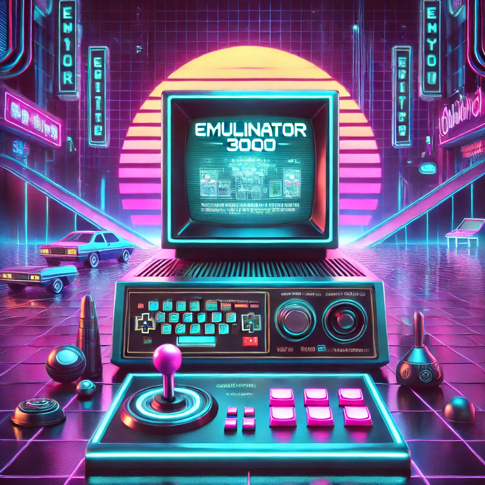

# Emulinator

**Emulinator** es un emulador de consolas que soporta **CHIP-8**, **Super CHIP-8** y **NES**, desarrollado como proyecto de la asignatura *Programación IV* de la Universidad de Deusto. El sistema se basa en una arquitectura cliente-servidor, donde el servidor realiza toda la emulación y el cliente se encarga de enviar entradas del teclado y mostrar la imagen y sonido.

## Características

- Emulación de CHIP-8, Super CHIP-8 y NES.
- Cliente/Servidor: el servidor realiza toda la emulación; el cliente solo envía entradas y muestra los resultados.
- Sistema de usuario con inicio de sesión y registro.
- Funcionalidades de perfil: amigos, logros, partidas guardadas, tiempo jugado.
- Configuración de escala de pantalla y cambio de contraseña.

## Tecnologías utilizadas

- **Servidor:** Lenguaje C
- **Cliente:** Lenguaje C++ con SDL2 y SDL2_ttf
- **Compilación multiplataforma:** soporte para Linux y Windows (mingw32)

## Instalación

### Linux

1. Asegúrate de tener instaladas las librerías SDL2 y SDL2_ttf:
   ```bash
   sudo apt install libsdl2-dev libsdl2-ttf-dev
   ```
2. Compila el proyecto:
   ```bash
   make
   ```

### Windows

1. Instala `mingw32` y ejecuta la consola `mingw32`.
2. Instala las librerías SDL2 y SDL2_ttf para `mingw32`.
3. Dentro de la consola `mingw32`, ejecuta:
   ```bash
   make
   ```

## Ejecución

Después de compilar:

- Ejecutar el **servidor**:
  ```bash
  ./bin/emulinator3000
  ```

- Ejecutar el **cliente**:
  ```bash
  ./bin/cliente
  ```

## Interfaz del Cliente

```
Seleccione una de las siguientes opciones
1. INICIAR SESION
2. REGISTRARSE
0. Salir
Opcion:

--------- EMULINATOR 3000 ---------
Bienvenido 1!
Seleccione la opcion deseada:

-- Emular Consola --
1. CHIP-8
2. NES

p. Perfil de usuario
c. Configuracion

0. Salir
Opcion:
```

## Autores

Este proyecto ha sido desarrollado como trabajo grupal de la asignatura **Programación IV** de la **Universidad de Deusto**.

**Grupo PVI-09:**

- Mikel Albisu  
- Cesar Veiga  
- David Reguera  
- Aimar Arriaga  

*Se ha utilizado inteligencia artificial como asistencia durante el desarrollo del proyecto.*

## Licencia

Este proyecto está licenciado bajo la licencia [MIT](https://opensource.org/licenses/MIT).
